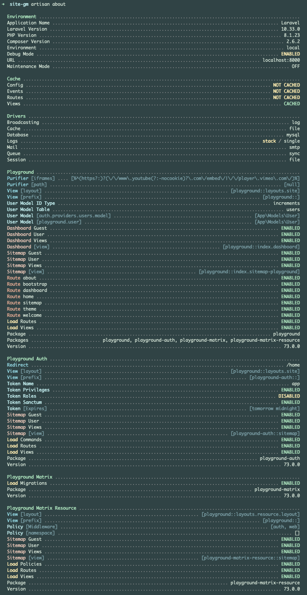

# Playground

[](https://raw.githubusercontent.com/gammamatrix/playground/testing/develop/testdox.txt)
[](tests)
[](.github/workflows/ci.yml#L99)

This is the base package for Playground.

This package provides model handling for [Laravel](https://laravel.com/docs/13.x) packages.
- Playground uses [Laravel ordered UUIDs](https://laravel.com/docs/13.x/strings#method-str-ordered-uuid) for primary keys.
- Packages are compatible and tested with and without: middleware, roles, policies, privileges, Sanctum...

Read more on using Playground [at the Read the Docs for Playground.](https://gammamatrix-playground.readthedocs.io/)

## Installation

You can install the package via composer:

```bash
composer require gammamatrix/playground
```

## Configuration

You can publish the configuration file with:
```bash
php artisan vendor:publish --provider="GammaMatrix\Playground\ServiceProvider" --tag="playground-config"
```

See the contents of the published config file: [config/playground.php](config/playground.php)

## `artisan about`

Playground provides information in the `artisan about` command.




### Environment Variables

|  env()                              | config()                            |
|-------------------------------------|-------------------------------------|
| `PLAYGROUND_LOAD_MIGRATIONS` | `playground.load.migrations` |
- The loading option for migrations does not take effect if the migrations have been exported to your app. The control for loading is handled in the package [ServiceProvider.](src/ServiceProvider.php)


## Migrations

The migrations provided in this package are used for [PHPunit 13](https://docs.phpunit.de/en/13.0/) feature testing with [Orchestra Testbench](https://packages.tools/testbench.html).
- They will not be exported in software builds.

## Cloc

```sh
composer cloc
```

```
➜  playground git:(develop) ✗ composer cloc
      83 text files.
      67 unique files.                              
     153 files ignored.

github.com/AlDanial/cloc v 2.08  T=0.04 s (1490.4 files/s, 152447.7 lines/s)
-------------------------------------------------------------------------------
Language                     files          blank        comment           code
-------------------------------------------------------------------------------
PHP                             45           1011            856           3503
XML                             14              0              9           1023
YAML                             1              4              0            188
JSON                             3              0              0            101
Markdown                         3             43              0            100
INI                              1              3              0             12
-------------------------------------------------------------------------------
SUM:                            67           1061            865           4927
-------------------------------------------------------------------------------
```

## PHPStan

Tests at level 10 on:
- `config/`
- `database/`
- `src/`
- `tests/Feature/`
- `tests/Unit/`

```sh
composer analyse
```

## Coding Standards

```sh
composer format
```

## Testing

```sh
composer test
```

## Changelog

Please see [CHANGELOG](CHANGELOG.md) for more information on what has changed recently.

## Credits

- [Jeremy Postlethwaite](https://github.com/gammamatrix)

## License

The MIT License (MIT). Please see [License File](LICENSE.md) for more information.
