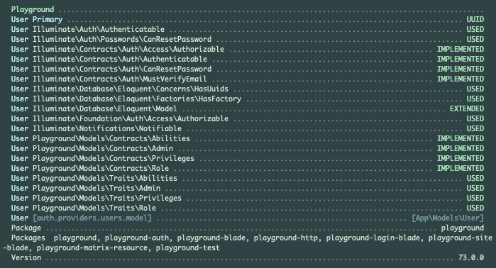

# Playground

[](https://raw.githubusercontent.com/gammamatrix/playground/testing/develop/testdox.txt)
[](tests)
[](.github/workflows/ci.yml#L120)

This is the base package for Playground.

This package provides model handling for [Laravel](https://laravel.com/docs/10.x) packages.
- Playground allows using [Laravel ordered UUIDs](https://laravel.com/docs/10.x/strings#method-str-ordered-uuid) for primary keys.
- The configuration in Playground and subpackages permits defining the user model, table and primary key type: `increments` or `uuid`.
- Packages are compatible and tested with and without: middleware, roles, policies, privileges, Sanctum...

Read more on using Playground [at the Read the Docs for Playground.](https://gammamatrix-playground.readthedocs.io/)

## Installation

You can install the package via composer:

```bash
composer require gammamatrix/playground
```

## Configuration

You can publish the configuration file with:
```bash
php artisan vendor:publish --provider="GammaMatrix\Playground\ServiceProvider" --tag="playground-config"
```

See the contents of the published config file: [config/playground.php](config/playground.php)

## `artisan about`

Playground provides information in the `artisan about` command.




## Migrations

The migrations provided in this package are used for [PHPunit 10](https://docs.phpunit.de/en/10.5/) feature testing with [Orchestra Testbench](https://packages.tools/testbench.html).
- They will not be exported in software builds.

## Testing

```sh
composer test
```

## Changelog

Please see [CHANGELOG](CHANGELOG.md) for more information on what has changed recently.

## Credits

- [Jeremy Postlethwaite](https://github.com/gammamatrix)

## License

The MIT License (MIT). Please see [License File](LICENSE.md) for more information.
